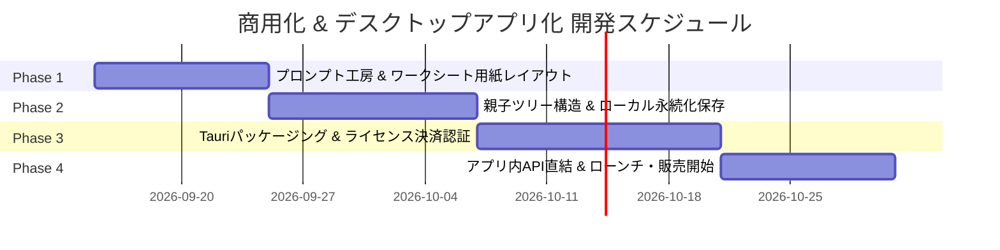

# プロダクト商用化・デスクトップアプリ化ロードマップ & プライシング戦略仕様書

- **文書バージョン**: 1.0.0
- **作成日**: 2026-09-11
- **対象プロダクト**: Mini Test Maker（小テスト・プリント作成 ＆ 前提理解ワークシート自動生成アプリ）
- **主要アーキテクチャ**: Next.js / TypeScript / Tailwind CSS ➔ Tauri（デスクトップアプリ化）
- **主要販売形態**: 本体買い切り（永続ライセンス） ＋ AIトークン（都度課金 / サブスク / BYOK）

---

## 1. エグゼクティブサマリー & ビジネスモデル

### 1.1 プロダクトの核となる提供価値
1. **完全ローカル保存による著作権・機密データの保護**
   - 塾のオリジナル教材、模試の過去問、市販テキストから抽出したデータを外部サーバーに一切送信・保管せず、先生のPC内だけで完結。
2. **「前提問題」「概念解説」「スモールステップ例題」「類題」の即時ワークシート化**
   - つまずいた生徒に対して、その場で前提に遡るプリントや類題を数秒〜数分で生成・印刷。
3. **買い切りの安心感と低ランニングコスト**
   - 外部AI（ChatGPT/Claude等）へのコピペ利用なら**永年月額0円**。
   - アプリ内で手軽に自動生成したいユーザー向けに「AIトークン（チケット / サブスク）」を提供。

---

## 2. 推奨プライシング設計

### 2.1 本体ライセンス（買い切り）

| 商品・エディション | 価格（税込） | 対象ユーザー | 提供内容・ライセンス条件 |
| :--- | :--- | :--- | :--- |
| **パーソナル / 教員向け** | **9,800円 〜 14,800円**<br>*(初期ローンチ特割: 7,800円)* | 個人の教員、家庭教師、小規模個人塾 | ・デスクトップアプリ永続ライセンス（PC 2台まで）<br>・外部AIコピペ利用は無制限・永年無料<br>・購入特典：AI生成チケット 20回分付属 |
| **プロ / 教室・塾向け** | **29,800円 〜 39,800円** | 学習塾、予備校、法人スクール | ・同一教室内のPC 5台まで利用可能<br>・プリントの教室名・ロゴ・ヘッダーカスタマイズ<br>・購入特典：AI生成チケット 100回分付属 |

### 2.2 AI生成トークン（アドオン課金）

自社サーバー経由でOpenAI/Anthropic等のAPIを叩き、ワンクリックで前提問題・解説・類題を生成する機能の利用権。

| 課金方式 | 価格（税込） | 単価 | 想定利用シーン・ターゲット |
| :--- | :--- | :--- | :--- |
| **都度チケット (50回分)** | **1,200円** | 24円 / 回 | 有効期限なし。定期テスト前や季節講習のみ集中的に使うライト〜ミドル層 |
| **都度チケット (150回分)** | **2,980円** | 約19.8円 / 回 | まとめ買い割引。テスト対策パック |
| **月額サブスク (スタンダード)** | **980円 / 月** | 約12.3円 / 回 | 毎月80回分付与。日常的にプリントを毎週作成するアクティブ層 |
| **BYOK (APIキー持ち込み)** | **追加 0円** | 原価のみ | 自身のOpenAI/Claude APIキーを登録可能。開発者・教育ギークの口コミ拡散用 |

> **粗利シミュレーション**:
> GPT-4o-miniやClaude 3.5 Haiku等の軽量・高速・賢い最新モデルを利用した場合、1回の生成にかかるAPI原価は約0.2〜0.5円。
> 50回チケット（1,200円）あたりの原価は約15〜25円であり、**原価率わずか1.5〜2%、粗利率98%の極めて安全な収益構造**となります。

---

## 3. なぜデスクトップアプリ化（Tauri）が最適なのか

```
【Webアプリの課題】
・「ブラウザのURL」に対して1万円の買い切りは「いつ閉鎖されるか」という不安が生じやすい
・ユーザーがブラウザのキャッシュ/履歴をクリアするとデータが消えるリスク
・入試過去問やテキストを入力する際、「サーバーに送信されていないか」の疑念が残る

【デスクトップアプリ（Tauri）の優位性】
◎ PCにインストールするソフトウェアなので「一生使える道具」としての所有感・納得感が抜群
◎ データはPC内のローカルファイル（JSON/SQLite）として保存されるため、消滅リスクゼロ＆バックアップ容易
◎ 完全にオフラインでも起動・利用可能（コピペ運用含む）
◎ Tauriならアプリ容量わずか10〜15MB程度（Electronのように重くない）
```

---

## 4. 開発ロードマップ（4段階）



---

### Phase 1: コピペ完結型プロンプト工房 ＆ 解説枠付きワークシート新設
> **目的**: 外部AI（ChatGPT/Claude無料版）をフル活用し、0円で最高品質の「前提問題・解説・類題」を作成できる体験をブラウザ上で完成させる。

1. **前提理解・スモールステップ生成プロンプト工房の実装**
   - 既存の `GenerateSimilarPromptModal` を拡張。
   - 目的別プロンプトのワンクリック生成：
     - ① **前提概念の逆引き解説**: 「この問題を解くために必要な基礎知識を中学生向けにわかりやすく解説」
     - ② **スモールステップ例題**: 「公式や考え方を1手ずつ確認できる穴埋め・誘導形式の導入問題」
     - ③ **類題・数値替え問題**: 「思考プロセスは同一でシチュエーションや数値を変えた演習問題」
   - 外部AIから返ってきた結果をそのまま貼り付ければ即座に問題データとして取り込める入力パーサーの整備。
2. **ワークシート用紙レイアウト（解説枠＋例題＋演習）の新設**
   - STEP 3の用紙印刷レイアウトに「ワークシート（1枚完結）モード」を追加。
   - 上段：概念まとめ・ポイント枠（メモ・囲み罫線付き）
   - 中段：解き方の例題（思考プロセスの記載）
   - 下段：生徒が実際に手を動かす類題・小問演習欄

---

### Phase 2: 親子ツリー構造 ＆ ローカル完全永続化
> **目的**: 過去問・テキストの元問題と、そこから派生した教材をローカルで安全に管理・ストックできるようにする。

1. **親子ツリーデータモデル（Parent-Child Structure）の導入**
   - 元問題（過去問 / テキスト問題）を「親」とし、派生した「前提解説」「例題」「類題」を「子」としてグルーピング。
   - 「この過去問でつまずいたら、この前提プリントを出す」という教材ストックを直感的に管理。
2. **ローカルデータベース永続化（IndexedDB / LocalStorage）**
   - ブラウザをリロードしても作成した問題集・ワークシートが消えない設計。
   - JSON形式での教材パックのエクスポート / インポート機能（バックアップ・他PCへの移行用）。

---

### Phase 3: デスクトップアプリ化（Tauri）＆ 買い切りライセンス認証
> **目的**: インストール型アプリとしてパッケージングし、商用販売基盤を構築する。

1. **Tauri v2 によるデスクトップアプリ化**
   - Next.jsのフロントエンド（静的エクスポート）をTauriに組み込み。
   - Windowsインストーラー（`.msi` / `.exe`）および Mac用（`.dmg`）の自動ビルド設定。
   - ファイルシステムへの直接保存機能（指定フォルダに教材ファイルを自動保存）。
2. **買い切りライセンス認証基盤の実装**
   - Stripe Checkout連携（LPまたはECサイト上でクレジットカード決済）。
   - 決済完了時に一意の「ライセンスキー」を自動発行・メール送信。
   - アプリ初回起動時のライセンスキー認証（マシン固有IDによる1〜2台制限、オフライン認証トークン対応）。

---

### Phase 4: アプリ内AIトークン直結 ＆ 本格ローンチ
> **目的**: コピペの手間を省きたいユーザー向けに、アプリ内でワンクリック生成できる有料トークン機能をリリース。

1. **アプリ内AI自動生成機能**
   - ボタン1つで「前提問題を作成」「類題を3問生成」がアプリ内で即座に完了するパイプライン。
2. **トークン課金基盤（都度チャージ ＆ 月額サブスク）**
   - Stripe Billing連携による月額サブスクリプション。
   - チャージ残高（残り〇〇回）のローカル同期と安全なトークン消費API。
   - **BYOK（APIキー持ち込み設定）**：設定画面から自身のOpenAI/Claude APIキーを入力すれば、トークン購入不要で無制限生成できる機能。
3. **ローンチ＆プロモーション**
   - 教員向け・塾講師向けLP（ランディングページ）公開。
   - 「過去問を入れるだけでスモールステップ演習プリントができるソフト」としてのX（旧Twitter）/ note発信・デモ動画公開。

---

## 5. 開発着手に向けた直近のアクション

まずは現在のWeb環境（Next.js）のまま、ユーザーが最も感動するコア機能である **Phase 1（教材生成プロンプト工房の拡張 ＆ ワークシート用紙レイアウト新設）** の実装を進めることを推奨します。
